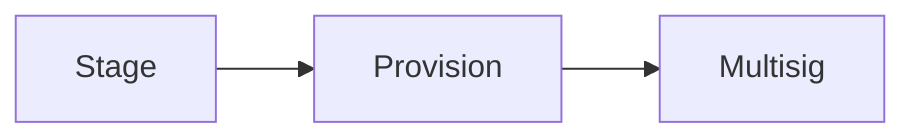
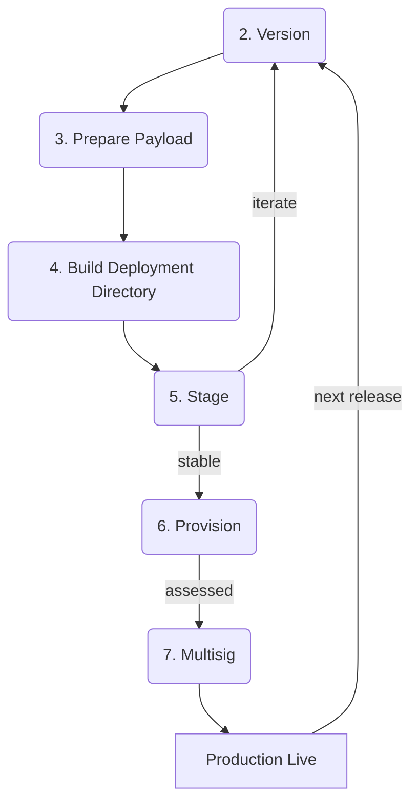

# hello-pear-react-native <a name="hello-pear-react-native"></a>

> Pear Hello World for React Native on mobile with `pear-mobile`

Quick start boilerplate for embedding [pear-mobile][pear-mobile] into React Native apps and deploying peer-to-peer application updates.

- Peer-to-Peer Over-the-Air updates of the JavaScript bundle
- Embedded [Bare][bare] runtime worklets
- Application storage management
- Staged deployment pipeline with multisig production releases

Built with [Expo][expo] SDK v55 on [React Native][react-native].

## MVP - EXPERIMENTAL

This boilerplate is MVP and Experimental.

## Table of Contents

- [OS Support](#os-support)
- [Requirements](#requirements)
- [Terminology](#terminology)
- [Development](#development)
  - [Install](#install)
  - [Set an upgrade link](#set-a-development-upgrade-link)
  - [Bundle the worker](#bundle-the-worker)
  - [Run](#run)
- [Architecture](#architecture)
  - [Updates](#updates)
  - [Storage](#storage)
  - [Workers](#workers)
- [Version management](#version-management)
- [Peer-to-Peer Deployments](#deployments)
  - [Release Cycle](#release-cycle)
  - [0. Touch and Seed](#touch-and-seed)
  - [1. Set upgrade link](#set-upgrade-link)
  - [2. Version](#version)
  - [3. Prepare Payload](#prepare-payload)
  - [4. Build Deployment Directory](#build-deploy-directory)
  - [5. Stage](#stage)
  - [6. Provision](#provision)
  - [7. Multisig](#multisig)
  - [Distribute](#distribute)
- [Plugin (OTA bundle loading)](#plugin-ota-bundle-loading)
- [Application update flow](#application-update-flow)
- [CI](#ci)
- [Scripts](#scripts)
- [Troubleshooting](#troubleshooting)

## OS Support <a name="os-support"></a>

- iOS
- Android

## Requirements <a name="requirements"></a>

- `npm` via [Node.js][nodejs] — `node --version` >= 20.19.4 (enforced by React Native 0.83)
- [`pear`][pear-docs] — `npx pear`, required for the deployment flow

[more info](https://docs.expo.dev/versions/latest/#each-expo-sdk-version-depends-on-a-react-native-version)

#### For iOS <a name="requirements-ios"></a>

- `xcodebuild -version` >= 26.2 — Expo SDK 55 builds against a current Xcode. React Native's own hard floor is 16.1 (below it the build raises `Please upgrade XCode`), but that is not sufficient for this SDK
- iOS version >= 15.1 — React Native's minimum deployment target

#### For Android <a name="requirements-android"></a>

- Android version >= 10 (API 29) — [react-native-bare-kit][react-native-bare-kit] sets `minSdk 29`, mirrored by `expo-build-properties` in `app.json`

[more info](https://docs.expo.dev/versions/latest/#support-for-android-and-ios-versions)

## Terminology <a name="terminology"></a>

- **OTA** - Over-the-Air. Data delivery without manual intervention
- **OTA Updates** - Direct software updates to running applications without manual reinstallation. On mobile an OTA replaces the **JavaScript bundle only**; native code ships through the App Store and Play Store
- **P2P** - Peer-to-Peer. Direct point-to-point communication between machines/devices without central servers
- **application drive** - the [Hyperdrive][hyperdrive] behind a Pear application
- **Deployment Directory** - the build directory that is staged; here it is `dist/`
- **worklet** - an embedded [Bare][bare] runtime instance hosted by the React Native app
- **multisig** - a co-signing protocol requiring a quorum of signers before writes can be committed. This cryptographically binds project integrity to collective sign-off
- **pear link** - a [link format][pear-link-format] for addressing peer-to-peer applications
- **quorum** - the minimum number of signers needed to commit a multisig write
- **release lines** - parallel deployment streams at different stability levels
- **seeding** - exposing a drive to peers for discovery and download
- **versioned link** - a pear link of the form `pear://<fork>.<length>.<key>` where fork, length and key correspond to [core.fork][hypercore-fork], [core.length][hypercore-length] and [core.key][hypercore-key] of the [Hypercore][hypercore] behind the [Hyperdrive][hyperdrive]

## Development <a name="development"></a>

### Install <a name="install"></a>

```sh
npm install
```

> [!NOTE]
> `npm install` currently fails from a clean state. `hello-pear-worker`, `pear-mobile` and `pear-runtime-react-native` resolve from `file:../<repo>/<name>-<version>.tgz` build outputs of sibling repositories, and `hello-pear-worker-1.0.0.tgz` does not exist even locally — the install ends in `ENOENT`. Because both CI jobs install before they run, CI is red on every push until these become published semver ranges. An existing `node_modules/` keeps working; do not delete it before restoring the tarballs or replacing the specs.

### Set an upgrade link <a name="set-a-development-upgrade-link"></a>

> [!CAUTION]
> This step is required before running the app, including in development.

The committed `upgrade` field is the placeholder `pear://<YOUR_KEY_HERE>`. `pear-runtime-updater` parses the link **unconditionally in its constructor** — the `updates` flag is recorded but never gates the parse — so the placeholder throws `ERR_INVALID_URL` and kills the worklet at startup, even though this template disables updates in development. React Native never learns the worker died: the app renders its version and nothing else ever arrives.

Create a link and set it:

```sh
pear touch
```

```sh
npm pkg set upgrade=pear://qxenz5wmspmryjc13m9yzsqj1conqotn8fb4ocbufwtz9mtbqq5o
```

Committing a real development link is safe — the link only selects which drive the updater follows.

### Bundle the worker <a name="bundle-the-worker"></a>

> [!CAUTION]
> This step is required before running the app in any environment, and again after every change to `workers/main.js` or to a package the worker imports.

```sh
npm run bundle:bare
```

Packs the worker for the BareKit runtime with [bare-pack][bare-pack], targeting iOS arm64, the iOS arm64 and x64 simulators, and Android arm64. The output, `src/worker.bundle.js`, is gitignored and is imported directly by `src/App.tsx`. Nothing rebuilds it automatically — a stale bundle fails silently, because the app still boots and the UI still looks normal.

### Run <a name="run"></a>

```sh
npm run ios       # expo run:ios
npm run android   # expo run:android
```

Development builds always load JavaScript from Metro, so OTA bundle selection is never exercised. Use the release variants to test updates:

```sh
npm run production:ios
npm run production:android
```

## Architecture <a name="architecture"></a>

The application architecture is tightly scoped to handling P2P OTA updates, running an embedded [Bare][bare] worklet and facilitating [Peer-to-Peer Deployment](#deployments) flows.

Peer-to-peer logic runs in the worklet, which acts as the local backend for the React Native view. The React Native export of `pear-mobile` starts the worklet; the Bare export creates the updater and storage inside it.

### Updates <a name="updates"></a>

An update occurs when the seeded application drive is written to with a higher version.

The React Native layer passes the updates flag, the running `package.json` `version`, the upgrade link and the app name into the worklet. The worker owns the [Corestore][corestore], the [Hyperswarm][hyperswarm] connection and the updater, and reports progress back over the pipe.

The pipe carries plain UTF-8 strings, framed by [framed-stream][framed-stream] on both ends and compared by exact equality:

| Frame                | Direction    | Meaning                              |
| -------------------- | ------------ | ------------------------------------ |
| `Hello from worker`  | worker → app | worker booted                        |
| `updating`           | worker → app | payload is downloading               |
| `updated`            | worker → app | payload is staged and ready to apply |
| `minver-required`    | worker → app | payload needs a newer native release |
| `pear:applyUpdate`   | app → worker | install the staged payload           |
| `pear:updateApplied` | worker → app | payload installed                    |

This example waits for the user to press **Apply update** rather than applying automatically.

An update is not announced the instant it is staged. The updater checks once when it opens, and after that a drive append schedules a check on a **randomized delay drawn once per process, up to one hour by default**. Appends within 60 seconds of boot are checked immediately, and each new append reschedules the pending check. Only a strictly-newer [SemVer][semver] wins; there is no downgrade path, so a rollback must be re-staged under a higher version.

#### Disabling Updates <a name="disabling-updates"></a>

The first worker argument enables or disables updates. Any value other than the string `'false'` enables them. This example disables them in development and enables them in release builds:

```js
const IPC = PearRuntime.run('/worker.bundle', bundle, [
  (!__DEV__).toString(),
  version,
  upgrade,
  appName
])
```

Note that disabling updates does not skip constructing the updater — see [Set an upgrade link](#set-a-development-upgrade-link).

### Storage <a name="storage"></a>

Storage is provided by `pear-mobile` inside the worklet. The default directory is the platform's persistent application-data directory, and `pear.storage` defaults to its `app-storage` child:

- iOS: the app's Application Support directory
- Android: the app's `files` directory

These are the same locations the patched native boot code reads the OTA bundle from, which is what makes the applied update visible to the next launch. Any custom directory must also be persistent.

The worklet keeps `pear-runtime/corestore`, `pear-runtime/next/<length>.<fork>/` (the staged payload) and `pear-runtime/ota/` (the installed payload) under that directory.

### Workers <a name="workers"></a>

The worker body lives in the [hello-pear-worker][hello-pear-worker] package so that one implementation serves both this template and the desktop templates:

```js
require('hello-pear-worker')
```

That package's `imports` map resolves the specifier `pear-runtime` to `pear-mobile` on iOS, Android and simulators, and to the desktop `pear-runtime` elsewhere. To develop the worker in-project instead, copy `hello-pear-worker/index.js` into `workers/main.js`; it then resolves against this `package.json`, so any Node builtins it uses need an `imports` entry here.

The React Native side starts it with the static `PearRuntime.run()` from `pear-mobile` and gets back the worklet's IPC duplex:

```js
import PearRuntime from 'pear-mobile'
import bundle from './worker.bundle.js'

const IPC = PearRuntime.run('/worker.bundle', bundle, argv)
```

The other side of that stream is `Bare.IPC` inside the worker. The IPC duplex emits plain `Uint8Array` chunks rather than Buffers, so decode with `b4a.toString(data)` — `data.toString()` yields a comma-joined byte list.

`console.log` inside the worklet goes to the system log, not the Metro console: use `xcrun simctl spawn booted log stream` on iOS or `adb logcat` on Android.

## Version management <a name="version-management"></a>

Native releases and OTA releases share one monotonically increasing [SemVer][semver] sequence. `package.json` `version` is the single source of truth and the only version that should be edited.

- `app.config.js` exposes `package.json` `version` as the Expo `version`. Expo writes it to iOS `CFBundleShortVersionString` and Android `versionName` during prebuild. `app.config.js` fully replaces `app.json` for Expo — `app.json` reaches Expo only through the `require('./app.json')` inside it — and because the export is `{ ...app.expo, version }`, `package.json` always wins. A `version` added to `app.json` is silently ignored, not honoured. The real hazard is deleting that `require`, the spread, or the `version` key, any of which drops the sync.
- `npm run build` copies the same `package.json` into `dist/`. Its `version` is the OTA version used by the updater and stored beside the installed OTA bundle.
- `pear.json` contains `updates.minver`. This is the oldest app version compatible with the current OTA payload; it is not the OTA version.

> [!IMPORTANT]
> After changing `package.json` `version` for a native release, run `npm run prebuild` before building. Existing generated `ios/` and `android/` projects retain the previous native version until they are regenerated.

Comparison uses full SemVer precedence, including prerelease ordering (`1.0.0-alpha` < `1.0.0`), on both the Bare and native sides. Strings that are not valid SemVer are treated as "not newer" and never selected.

The ordering rules are:

1. Every OTA version must be greater than the installed native version and every previously published OTA version.
2. Every new native release must be greater than every previously published OTA version. Otherwise an older OTA with a higher version can continue to override the newly installed native bundle.
3. Never reuse or decrease a published version.

For a compatible JavaScript-only OTA:

1. Bump `package.json` `version`.
2. Leave `pear.json` `updates.minver` unchanged.
3. Run `npm run update`, then stage and seed the resulting `dist/`.

For a release that changes native code, native dependencies, or the OTA/native contract:

1. Choose a `package.json` `version` greater than every previous native and OTA release.
2. Set `pear.json` `updates.minver` to that same version.
3. Run `npm run prebuild`, build the native release, and publish it to the stores.
4. Run `npm run update`, then stage and seed only when the required store release is available.

Clients below `updates.minver` are meant to skip the incompatible OTA so the user can be directed to the App Store or Play Store.

> [!WARNING]
> The minimum-version gate does not currently fire. `pear-mobile` emits `minver-required`, but `hello-pear-worker` listens for `update-incompatible`, which nothing emits — so the frame never reaches the app and the "update available on the store" state is unreachable. Until that is fixed, treat rule 2 above as manual discipline rather than an enforced guard, and gate native-breaking OTAs by not staging them until the store release is live.

Example: native `1.0.0` can receive OTA `1.0.1`, then OTA `1.1.0`. The next native release must be greater than `1.1.0`; choosing native `2.0.0` and setting `minver` to `2.0.0` prevents older native clients from applying updates that require the new native runtime.

## Peer-to-Peer Deployments <a name="deployments"></a>

Application builds are written to [pear:// links][pear-link-format] through three operations — stage, provision and multisig — used to create successive layers of deployment with increasing trust guarantees:

- **Stage** - local checks, checks between dev peers, builds without store signing, feature branches, ephemeral throwaways
- **Provision** - prereleases, stakeholder preview, Quality Assurance, dogfooding
- **Multisig** - production, multisig'd by stakeholders, machine-independent, tamper-resistant

Each operation feeds into the next: a staged link is the source for a provisioned link, a provisioned link is the source for a multisig'd link.



Each of those links is a **release line**, and `package.json` `upgrade` decides which one a build belongs to. Because an OTA only reaches devices already running a compatible native build, a mobile release line is paired with whatever store build its users have installed — see [Version management](#version-management).

### Release Cycle <a name="release-cycle"></a>

Once the upgrade link exists, the delivery flow is always the same. An update will not occur unless `package.json` `version` is bumped.



### 0. Touch and Seed <a name="touch-and-seed"></a>

Create a new pear link:

```sh
pear touch
```

This outputs a link, for example `pear://qxenz5wmspmryjc13m9yzsqj1conqotn8fb4ocbufwtz9mtbqq5o`.

Seed it on the build machine, and reseed on other always-online machines:

```sh
pear seed pear://qxenz5wmspmryjc13m9yzsqj1conqotn8fb4ocbufwtz9mtbqq5o
```

The machine that runs `pear touch` is the build machine and has write access to that drive.

### 1. Set upgrade link <a name="set-upgrade-link"></a>

```sh
npm pkg set upgrade=pear://qxenz5wmspmryjc13m9yzsqj1conqotn8fb4ocbufwtz9mtbqq5o
```

### 2. Version <a name="version"></a>

Follow the appropriate workflow in [Version management](#version-management), then set the version:

```sh
npm version patch
```

### 3. Prepare Payload <a name="prepare-payload"></a>

Checklist:

- `package.json` `author`, `license`, `description`, `name` and `productName` set per brand
- `package.json` `upgrade` set to the release line's link
- `app.json` icons and identifiers set per brand
- `pear.json` `updates.minver` set per [Version management](#version-management)

Build the worker bundle, the app bundles, and the Deployment Directory:

```sh
npm run update
```

This runs `bundle:bare`, then `bundle:react-native` (which writes `out/ios/HelloPear/app.bundle` and `out/android/HelloPear/app.bundle` plus assets), then `build`.

React Native bundles are architecture-agnostic within a platform, so the same iOS directory is supplied for the device and both simulator hosts.

### 4. Build Deployment Directory <a name="build-deploy-directory"></a>

`npm run build` runs [pear-build][pear-build] and then copies `pear.json`:

```
dist/
  package.json
  pear.json
  by-arch/
    ios-arm64/app/HelloPear/app.bundle
    ios-arm64-simulator/app/HelloPear/app.bundle
    ios-x64-simulator/app/HelloPear/app.bundle
    android-arm64/app/HelloPear/app.bundle
```

`pear-build` copies `--package` to `dist/package.json` and mirrors each `--<host>` directory into `by-arch/<host>/app/`. It does **not** copy `pear.json` — that is the `cp -f pear.json dist/pear.json` tail on the `build` script — and it does **not** validate names.

> [!IMPORTANT]
> The `HelloPear` leaf is `package.json` `productName`, and it must match in three places: the `out/<platform>/HelloPear` paths in `bundle:react-native`, the directory basename passed to each `pear-build --<host>` flag, and the name the app passes into the worker. The updater looks for exactly `/by-arch/<host>/app/<productName>`. A partial rename produces a drive that stages, seeds and replicates perfectly and that the updater silently never matches.

Once `dist/` is populated it is ready to be staged, and optionally provisioned and multisigned.

### 5. Stage <a name="stage"></a>

Synchronize the Deployment Directory from disk to hypercore:

```sh
pear stage pear://qxenz5wmspmryjc13m9yzsqj1conqotn8fb4ocbufwtz9mtbqq5o dist
```

Run this on the build machine, then make sure the link is seeded.

### 6. Provision <a name="provision"></a>

Iterating produces many additions and deletions, and staging records all of them on the application drive. Provisioning syncs blocks from one drive to another and effectively removes intermediate history. Use `pear provision` to create a pre-production drive.

Create a target link with `pear touch`, then:

```sh
pear provision <versioned-source-link> <target-link> <versioned-production-link>
```

The source link is the stage link in versioned form `pear://<fork>.<length>.<key>`. The target link is the new unversioned link from `pear touch`. The production link is a versioned multisigned (or pre-production provisioned) link to sync onto the target before applying the source.

To bootstrap the first time, use the target link versioned as `0.0` as the production link:

```sh
pear provision pear://0.1079.qxenz5wmspmryjc13m9yzsqj1conqotn8fb4ocbufwtz9mtbqq5o pear://<target-from-touch> pear://0.0.<target-from-touch>
```

Later provisions use the previous provision (or multisig) link as the production link.

### 7. Multisig <a name="multisig"></a>

A multisig'd application drive is recommended for serious production deployment: a malicious build cannot be published without enough signers to establish quorum being compromised, and the production key is not machine-bound.

#### Create signing keys

Each signer runs:

```sh
pear multisig keys get
```

Each signer takes note of their public key and provides it as their signing key.

#### Create multisig config

Add a `multisig` property to `pear.json` with a `namespace` string, a `quorum` number and each signer's public key:

```json
{
  "updates": {
    "minver": "1.0.0"
  },
  "multisig": {
    "publicKeys": ["<pubkey1>", "<pubkey2>", "<pubkey3>"],
    "namespace": "holepunchto/hello-pear-react-native",
    "quorum": 2
  }
}
```

> [!NOTE]
> `npm run build` copies `pear.json` into `dist/` verbatim, so a `multisig` block ships inside every OTA payload. Any edit to it derives a different production key.

#### Set upgrade to the multisig link

```sh
pear multisig link
```

Set the resulting link as `package.json` `upgrade`, then run the release flow.

#### Request, sign, verify, commit

```sh
pear multisig request <versioned provision link>
pear multisig sign <signing request>
pear multisig verify <source-link> <signing request> [...responses]
pear multisig commit <source-link> <signing request>
```

`request` refuses unless the source drive is healthily seeded — solve that by reseeding the provision link on other peers. Verify before signing, and never abort a commit while it is running; if one is interrupted, run it again as soon as possible. Query any multisig link with `pear info --multisig <link>`.

### Distribute <a name="distribute"></a>

Native builds are distributed through the App Store and Play Store. OTA payloads reach installed apps over the application drive and require no store review, but they can only change JavaScript.

## Plugin (OTA bundle loading) <a name="plugin-ota-bundle-loading"></a>

The project is already configured to load the OTA bundle when present. No manual native edits are required.

**app.json** – the [pear-runtime-react-native][pear-runtime-react-native] Expo config plugin is registered in `expo.plugins`:

```json
"plugins": [
  ["pear-runtime-react-native/plugin"],
  ...
]
```

**metro.config.js** – extends both the React Native and Expo defaults, which is what `npx react-native bundle` uses to produce OTA payloads. The React Native half has to be there or the CLI warns that the config does not extend `@react-native/metro-config`:

```js
const { getDefaultConfig: getRNConfig, mergeConfig } = require('@react-native/metro-config')
const { getDefaultConfig: getExpoConfig } = require('expo/metro-config')

module.exports = mergeConfig(getRNConfig(__dirname), getExpoConfig(__dirname))
```

**What the plugin does** – during prebuild the config plugin patches the generated Swift `AppDelegate` and Kotlin `MainApplication`, guarded by a version marker so re-running prebuild is idempotent. Debug builds continue to use Metro. On a release launch, native code reads `pear-runtime/ota/app.bundle` and the adjacent `package.json`:

- iOS reads from the app's Application Support directory.
- Android reads from the app's files directory.

The OTA bundle is selected only when both files exist and its manifest version is greater than the installed native version. An equal version never overrides the native bundle, so installing a newer store release naturally supersedes an older OTA.

> [!IMPORTANT]
> `ios/` and `android/` are gitignored and regenerated by `expo prebuild`. Native OTA behavior can only change by regenerating them, so a folder left over from an older plugin version keeps its old boot code. Regenerate before concluding that an update problem is in JavaScript.

## Application update flow <a name="application-update-flow"></a>

- Ensure the upgrade link is seeded.
- Follow the compatible or native-breaking workflow in [Version management](#version-management).
- Prepare the payload with `npm run update`.
- Stage, and optionally provision then multisign.

When the application drive is written to, a running app eventually receives `updating` then `updated`. Applying installs `app.bundle` and its `package.json` under `pear-runtime/ota/` by swapping the staged directory into place, and the **next launch** selects between that bundle and the shipped one using the version rules above.

> [!WARNING]
> Applying is one-shot and unguarded. The updater marks itself applied before the swap, so a failure cannot be retried in-process, and the worker neither catches the error nor reports it — the UI stays on "Updating..." indefinitely. Production update UX needs a try/catch and a failure frame in the worker.

> [!WARNING]
> Reloading is not equivalent to relaunching on Android. iOS re-reads `bundleURL()` on every reload, so `reloadAppAsync()` picks up a freshly applied OTA. Android caches its `ReactHost` and captures the bundle path when that host is first created, so a reload reuses the old path and the update only takes effect after a full process restart.

## CI <a name="ci"></a>

`.github/workflows/ci.yaml` runs `npm run lint` on Ubuntu and `npm test` on a Bare base image for pushes to `main` and pull requests targeting `main`. It does not build the app, run prebuild, or exercise the worker bundle, and there are no unit tests.

`.github/workflows/publish.yml` publishes to npm on any `v*` tag — the tag shape `npm version` creates. This package is `private: true`, so such a tag produces a failing release job rather than a publish.

## Scripts <a name="scripts"></a>

### `npm run bundle:bare` <a name="script-bundle-bare"></a>

Packs the Bare worker into `src/worker.bundle.js`. Required before running the app, and after every worker change.

Uses: `npx bare-pack --host ios-arm64 --host ios-arm64-simulator --host ios-x64-simulator --host android-arm64 --linked --out ./src/worker.bundle.js ./workers/main.js`

---

### `npm run ios` / `npm run android` <a name="script-run"></a>

Run the app in a simulator or emulator.

Uses: `expo run:ios` / `expo run:android`

---

### `npm run production:ios` / `npm run production:android` <a name="script-production"></a>

Run the app in release mode. Required to exercise OTA bundle selection.

Uses: `npx expo run:ios --configuration Release` / `npx expo run:android --variant release`

---

### `npm run prebuild` <a name="script-prebuild"></a>

Regenerates the native `ios/` and `android/` folders and applies the config plugin.

Uses: `npx expo prebuild`

---

### `npm run bundle:react-native` <a name="script-bundle-react-native"></a>

Creates the iOS and Android JavaScript bundles under `out/`.

---

### `npm run build` <a name="script-build"></a>

Assembles the Deployment Directory in `dist/` with `pear-build`, then copies `pear.json` into it.

---

### `npm run update` <a name="script-update"></a>

Uses: `npm run bundle:bare && npm run bundle:react-native && npm run build`

---

### `npm run lint` <a name="script-lint"></a>

Lint only — this does **not** check formatting.

Runs: `lunte`

---

### `npm run format` <a name="script-format"></a>

Auto-format. This does not fix lint issues.

Runs: `prettier . --write`

---

### `npm test` <a name="script-test"></a>

Format check and lint.

Runs: `prettier . --check && lunte`

## Troubleshooting <a name="troubleshooting"></a>

### The app shows its version and nothing else <a name="app-shows-version-only"></a>

The worklet died at boot. Check the system log (`xcrun simctl spawn booted log stream`, `adb logcat`) — nothing surfaces in the Metro console. The most common cause is a placeholder or malformed `upgrade` link, which throws before updates are even consulted. See [Set an upgrade link](#set-a-development-upgrade-link).

### The app did not update <a name="app-did-not-update"></a>

- Was `package.json` `version` bumped? An equal version is never selected.
- Is the upgrade link correct, and is the drive seeded? `pear seed <link>`.
- Was `npm run bundle:bare` re-run after the worker changed?
- Is this a debug build? Debug always loads from Metro and never checks for an OTA.
- Has the delay elapsed? After the first check, appends schedule a check up to an hour out.
- On Android, was the app fully relaunched rather than reloaded?

### An update downloaded but the app still runs the old bundle <a name="old-bundle-still-running"></a>

Native boot selection rejected it. Both `app.bundle` and `package.json` must exist under `pear-runtime/ota/`, and the manifest version must be strictly greater than the installed native version. Confirm `ios/` and `android/` were regenerated with the current plugin.

### The updater never sees a peer <a name="no-peers"></a>

A stall is usually the network, not the code, and the two look identical. `pear seed <link> --json` prints `firewalled` and `natType`; `natType: "Random"` is symmetric NAT, which defeats holepunching. Seed from a host with a public address or cone NAT.

## LICENSE

Apache-2.0

<!-- Reference Links -->

[pear-mobile]: https://github.com/holepunchto/pear-mobile
[hello-pear-worker]: https://github.com/holepunchto/hello-pear-worker
[bare]: https://github.com/holepunchto/bare
[nodejs]: https://nodejs.org
[pear-docs]: https://docs.pears.com
[hyperdrive]: https://github.com/holepunchto/hyperdrive
[hypercore]: https://github.com/holepunchto/hypercore
[hypercore-fork]: https://github.com/holepunchto/hypercore#corefork
[hypercore-length]: https://github.com/holepunchto/hypercore#corelength
[hypercore-key]: https://github.com/holepunchto/hypercore?tab=readme-ov-file#corekey
[pear-link-format]: https://github.com/holepunchto/pear-link?tab=readme-ov-file#pear-link-format
[corestore]: https://github.com/holepunchto/corestore
[pear-runtime-react-native]: https://github.com/holepunchto/pear-runtime-react-native
[pear-build]: https://github.com/holepunchto/pear-build
[bare-pack]: https://github.com/holepunchto/bare-pack
[framed-stream]: https://github.com/holepunchto/framed-stream
[react-native-bare-kit]: https://github.com/holepunchto/bare-kit
[expo]: https://docs.expo.dev
[react-native]: https://reactnative.dev
[hyperswarm]: https://github.com/holepunchto/hyperswarm
[semver]: https://semver.org
